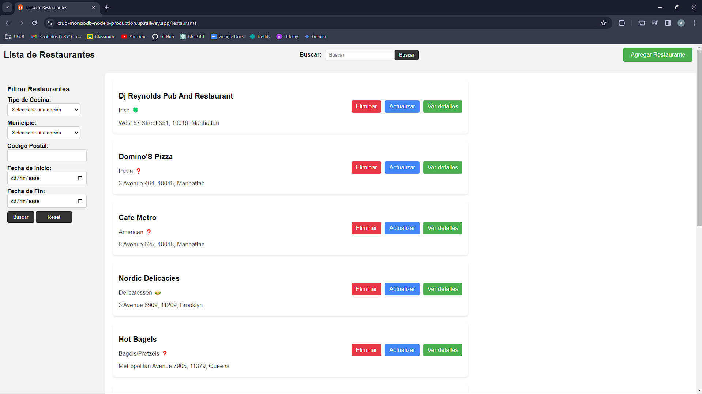

## Proyecto Node.js con MongoDB y EJS

Aquí encontrarás instrucciones para descargar el repositorio, configurarlo localmente y probar la aplicación. Este proyecto utiliza Node.js como backend, MongoDB como base de datos y EJS como motor de plantillas. Además, está desplegado en Railway.

### Pasos para probar la aplicación

#### 1. Clonar el repositorio
```git clone https://github.com/RKamey/crud-mongodb-nodejs.git```

#### 2. Instalar dependencias
```npm i```

#### 3. Crear archivo .env
Crear un archivo .env en la raíz del proyecto con las siguientes variables de entorno:

```MONOGO_URI=Tu_URI_de_MongoDB``` (puedes usar MongoDB Atlas)

### 4. Importar la base de datos
En la carpeta `database` encontrarás un archivo `restaurantes.json` que puedes importar a tu base de datos MongoDB. Puedes hacerlo con el siguiente comando desde la terminal: 

```mongoimport --uri "Tu_URI_de_MongoDB" --collection restaurantes --file restaurantes.json```

#### 5. Iniciar la aplicación

```npm start``` ó ```npx nodemon server```

#### 6. Probar la aplicación
Abre tu navegador y ve a http://localhost:3000

### Despliegue en Railway
El proyecto está desplegado en Railway y puedes acceder a él en: [https://crud-mongodb-nodejs-production.up.railway.app/](https://crud-mongodb-nodejs-production.up.railway.app/)

### Vista de la aplicación

